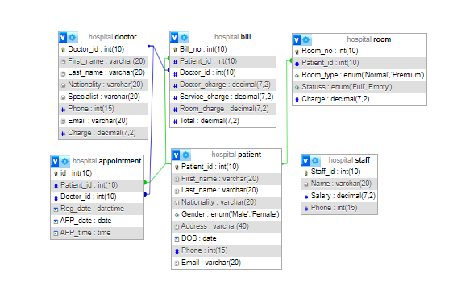

# Hospital Management System

This project is a **Hospital Management System** that manages patients, doctors, appointments, billing, rooms, and staff information. The system is implemented using MySQL and includes tables, triggers, and other database objects necessary for managing hospital operations.

## Table of Contents
- [Overview](#overview)
- [Features](#features)
- [Database Structure](#database-structure)
- [Installation](#installation)
- [Triggers](#triggers)
- [Usage](#usage)


## Overview
This Hospital Management System is designed to streamline the management of hospital operations. It includes functionalities to handle patient and doctor records, schedule appointments, manage room assignments, calculate bills, and much more. The project is built on MySQL and uses triggers to automate various tasks.

## Features
- **Patient Management**: Store and manage patient information including personal details, medical history, and contact information.
- **Doctor Management**: Manage doctors' information, specialties, and charges.
- **Appointments**: Schedule and manage patient appointments with doctors.
- **Billing**: Automatically calculate and update bills based on appointments and room assignments using triggers.
- **Room Management**: Assign rooms to patients and update room status.
- **Staff Management**: Store and manage hospital staff information.

## Database Structure
The project includes the following tables:

- `Patient`: Stores patient information.
- `Doctor`: Stores doctor information.
- `Appointment`: Manages patient appointments with doctors.
- `Bill`: Calculates and stores billing information.
- `Room`: Manages room assignments and statuses.
- `Staff`: Stores hospital staff information.



## Installation
To set up the project locally, follow these steps:

- **Clone the repository:**
   ```bash
   git clone https://github.com/your-username/hospital-management-system.git
   
## Triggers
- **billing_and_update_charges**: This trigger is used to insert billing information and update charges automatically whenever a new appointment is scheduled.

- **upd_room**: This trigger is executed before inserting a new record into the Room table. It automatically sets the room status to 'Empty' if the Patient_id is NULL, indicating the room is unoccupied. If a Patient_id is provided, the status is set to 'Full', indicating the room is occupied.


## Usage
Once the database is set up, you can interact with it using SQL queries or integrate it with a web application. Below are some key SQL queries:

- **Insert a new patient:**
  ```sql
  INSERT INTO Patient (Patient_id, First_name, Last_name, Nationality, Gender, Address, DOB, Phone, Email)
  VALUES ('101', 'John', 'Doe', 'USA', 'Male', '123 Street', '1990-01-01', '1234567890', 'john@example.com');
- **Schedule an appointment:**
  ```sql
  INSERT INTO Appointment (Patient_id, Doctor_id, APP_date, APP_time)
  VALUES ('101', '203', '2024-08-15', '10:00:00');

## Hit the Star! ⭐
If you are planning to use this repo for learning, please hit the star. Thanks!

Authored by [Md. Akramul Islam](https://github.com/Akram0007).
